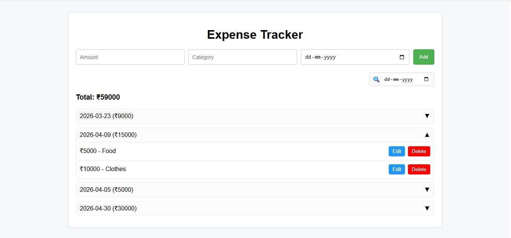

# Expense Tracker

## Overview

Expense Tracker is a web application that helps users manage their daily expenses. Users can add, update, and delete expenses, 
track spending in real time, and filter expenses based on date.

---

## Features

*  Add new expenses
*  Edit existing expenses
*  Delete expenses
*  Filter expenses by date
*  Organized expense list

---

## Tech Stack

### Frontend

* React.js
* Redux Toolkit
* Tailwind CSS

### Backend

* JSON Server (for local development)
* REST API

---

## Screenshots

### Expense Tracker



---

## Live Demo

https://expense-tracker-frontend-3yle.onrender.com/

---

## Run Locally

```bash
# Clone the repository
git clone https://github.com/dhwani1006/Expense_Tracker.git

# Install dependencies
npm install

# Run frontend
npm run dev

# Run JSON server (in another terminal)
npx json-server --watch db.json --port 5000
```

---

## How It Works

1. User adds an expense with amount, category, and date
2. Data is stored via API (JSON Server / Backend)
3. Expenses are displayed and can be filtered by date
4. User can edit or delete records

---

